# BÁO CÁO KỸ THUẬT

## HỆ THỐNG ỨNG DỤNG DU LỊCH ĐÀ NẴNG VÀ DASHBOARD QUẢN TRỊ

---

# CHƯƠNG 1: GIỚI THIỆU

## 1.1 TỔNG QUAN

### 1.1.1 Lý do chọn đề tài

Đà Nẵng là một trong những thành phố du lịch hàng đầu Việt Nam, với nhiều điểm tham quan nổi tiếng như Cầu Rồng, Bà Nà Hills, Ngũ Hành Sơn, và các bãi biển đẹp. Tuy nhiên, du khách thường gặp khó khăn trong việc:

- Tìm kiếm thông tin chi tiết về các điểm du lịch
- Định vị và điều hướng đến các địa điểm
- Tìm hiểu về các lễ hội và sự kiện văn hóa địa phương
- Đọc và chia sẻ đánh giá từ những du khách khác

Với sự phát triển nhanh chóng của công nghệ di động và trí tuệ nhân tạo, việc xây dựng một ứng dụng du lịch thông minh tích hợp AI là giải pháp hiệu quả để giải quyết những thách thức này.

### 1.1.2 Mục tiêu đề tài

**Mục tiêu chính:**

- Phát triển ứng dụng di động du lịch Đà Nẵng với giao diện thân thiện
- Tích hợp Trí tuệ nhân tạo (AI) hỗ trợ tìm kiếm ngữ nghĩa và chatbot tư vấn
- Xây dựng hệ thống quản trị (Dashboard) để quản lý nội dung và người dùng

**Mục tiêu cụ thể:**

1. Hiển thị danh sách điểm du lịch với thông tin chi tiết (hình ảnh, video, mô tả, đánh giá)
2. Tích hợp bản đồ với chức năng điều hướng và chỉ đường
3. Xây dựng hệ thống tìm kiếm ngữ nghĩa sử dụng OpenAI Embeddings và FAISS
4. Phát triển chatbot tư vấn du lịch AI với RAG (Retrieval-Augmented Generation)
5. Hệ thống đánh giá và bình luận của người dùng
6. Tích hợp thanh toán qua PayOS
7. Dashboard quản trị với đầy đủ chức năng CRUD

### 1.1.3 Ý nghĩa lý luận và thực tiễn

**Ý nghĩa lý luận:**

- Nghiên cứu và áp dụng các công nghệ hiện đại: React Native, FastAPI, NocoDB
- Nghiên cứu và triển khai các kỹ thuật AI: Semantic Search, RAG, Vector Database (FAISS)
- Áp dụng kiến trúc microservices với RESTful API

**Ý nghĩa thực tiễn:**

- Cung cấp công cụ hữu ích cho du khách đến Đà Nẵng
- Hỗ trợ quảng bá du lịch địa phương
- Tạo nền tảng để mở rộng cho các thành phố khác

### 1.1.4 Đề xuất triển khai

Hệ thống được triển khai theo mô hình 4 thành phần:

1. **Travel App Frontend (React Native)**: Ứng dụng di động cho người dùng cuối
2. **Travel App Backend (Python FastAPI)**: Server xử lý AI và tìm kiếm ngữ nghĩa
3. **Dashboard Frontend (React + Vite)**: Giao diện web quản trị
4. **Dashboard Backend (Node.js Express)**: API server cho dashboard

## 1.2 NHIỆM VỤ THỰC HIỆN ĐỀ TÀI

### 1.2.1 Phương pháp thực hiện

**Phương pháp nghiên cứu:**

- Nghiên cứu tài liệu về React Native, FastAPI, NocoDB
- Tìm hiểu các kỹ thuật AI: OpenAI API, FAISS, RAG
- Phân tích yêu cầu người dùng và thiết kế hệ thống

**Phương pháp phát triển:**

- Áp dụng phương pháp Agile/Scrum
- Phát triển theo module với tích hợp liên tục
- Kiểm thử và đánh giá ở mỗi giai đoạn

### 1.2.2 Phạm vi nghiên cứu

**Phạm vi chức năng:**

- Quản lý điểm du lịch (Locations)
- Quản lý lễ hội (Festivals)
- Quản lý người dùng (Users/Accounts)
- Hệ thống đánh giá (Reviews)
- Tìm kiếm ngữ nghĩa AI
- Chatbot tư vấn AI (RAG Chat)
- Bản đồ và điều hướng
- Thanh toán/Quyên góp (PayOS)

**Phạm vi địa lý:** Tập trung vào thành phố Đà Nẵng và vùng lân cận

### 1.2.3 Kết quả dự kiến

1. Ứng dụng di động hoàn chỉnh chạy trên Android và iOS
2. Hệ thống backend với AI tích hợp
3. Dashboard quản trị đầy đủ chức năng
4. Tài liệu kỹ thuật và hướng dẫn sử dụng

---

# CHƯƠNG 2: TỔNG QUAN CÔNG CỤ VÀ CÔNG NGHỆ

## 2.1 CÔNG CỤ THIẾT KẾ

### 2.1.1 Figma

- Công cụ thiết kế giao diện UI/UX
- Hỗ trợ thiết kế prototype và cộng tác nhóm

### 2.1.2 Draw.io / Mermaid

- Vẽ Use Case, Class Diagram, Sequence Diagram
- Tích hợp trong tài liệu Markdown

## 2.2 NGÔN NGỮ LẬP TRÌNH

### 2.2.1 TypeScript/JavaScript

- **Phiên bản:** TypeScript 5.9.3, JavaScript ES6+
- **Sử dụng:** Travel App Frontend, Dashboard Frontend, Dashboard Backend
- **Ưu điểm:** Type safety, IntelliSense, phát hiện lỗi sớm

### 2.2.2 Python

- **Phiên bản:** Python 3.10+
- **Sử dụng:** Travel App Backend (AI Server)
- **Ưu điểm:** Hệ sinh thái AI/ML phong phú, cú pháp đơn giản

## 2.3 FRAMEWORKS VÀ THƯ VIỆN

### 2.3.1 Travel App Frontend (React Native)

| Thư viện                      | Phiên bản | Mục đích                     |
| ----------------------------- | --------- | ---------------------------- |
| react-native                  | 0.74.2    | Framework mobile đa nền tảng |
| react                         | 18.2.0    | Thư viện UI                  |
| @react-navigation/native      | 6.1.18    | Điều hướng                   |
| @react-navigation/bottom-tabs | 6.6.1     | Tab điều hướng dưới          |
| @rnmapbox/maps                | 10.1.30   | Tích hợp bản đồ Mapbox       |
| axios                         | 1.7.2     | HTTP client                  |
| react-native-paper            | 5.12.5    | Components Material Design   |
| react-native-tts              | 4.1.0     | Text-to-Speech               |
| react-native-vision-camera    | 4.5.1     | Chức năng camera             |
| crypto-js                     | 4.2.0     | Mã hóa password              |

### 2.3.2 Travel App Backend (Python FastAPI)

| Thư viện       | Phiên bản | Mục đích                   |
| -------------- | --------- | -------------------------- |
| fastapi        | 0.108.0+  | Web framework              |
| uvicorn        | 0.25.0+   | ASGI server                |
| openai         | 1.51.0+   | Tích hợp OpenAI API        |
| faiss-cpu      | 1.7.4+    | Tìm kiếm vector tương đồng |
| numpy          | 1.24.0+   | Tính toán số học           |
| httpx          | 0.25.0+   | Async HTTP client          |
| firebase-admin | 6.5.0+    | Xác thực Firebase          |
| payos          | 1.0.0+    | Tích hợp thanh toán        |

### 2.3.3 Dashboard Frontend (React + Vite)

| Thư viện         | Phiên bản | Mục đích                 |
| ---------------- | --------- | ------------------------ |
| react            | 19.2.0    | Thư viện UI              |
| vite             | 7.2.4     | Build tool               |
| antd             | 6.0.1     | Ant Design UI components |
| react-router-dom | 7.10.0    | Routing                  |
| axios            | 1.9.0     | HTTP client              |
| typescript       | 5.9.3     | Type checking            |

### 2.3.4 Dashboard Backend (Node.js Express)

| Thư viện     | Phiên bản | Mục đích                      |
| ------------ | --------- | ----------------------------- |
| express      | 4.18.2    | Web framework                 |
| jsonwebtoken | 9.0.2     | Xác thực JWT                  |
| helmet       | 7.1.0     | Security headers              |
| cors         | 2.8.5     | Cross-origin resource sharing |
| crypto-js    | 4.2.0     | Mã hóa password               |
| axios        | 1.6.5     | HTTP client                   |
| dotenv       | 16.3.1    | Biến môi trường               |

## 2.4 CƠ SỞ DỮ LIỆU

### 2.4.1 NocoDB

- **Loại:** Headless Database (No-Code Database)
- **Giao diện:** REST API
- **Ưu điểm:**
  - Giao diện quản lý trực quan như spreadsheet
  - Tự động tạo API cho mỗi bảng
  - Hỗ trợ nhiều loại field (text, number, attachment, JSON)
  - Hosting trên cloud (app.nocodb.com)

### 2.4.2 FAISS (Facebook AI Similarity Search)

- **Loại:** Vector Database
- **Sử dụng:** Lưu trữ và tìm kiếm embeddings
- **Ưu điểm:** Tìm kiếm tương đồng nhanh, hiệu quả với dữ liệu lớn

## 2.5 DỊCH VỤ BÊN NGOÀI

### 2.5.1 OpenAI API

- **Models:** GPT-4o-mini, text-embedding-ada-002
- **Sử dụng:** AI Chatbot, tạo embeddings cho tìm kiếm ngữ nghĩa

### 2.5.2 Mapbox

- **Sử dụng:** Hiển thị bản đồ, điều hướng, chỉ đường
- **Tính năng:** Satellite view, traffic layer, offline maps

### 2.5.3 PayOS

- **Sử dụng:** Tích hợp thanh toán QR code
- **Tính năng:** Tạo payment link, webhook callback

### 2.5.4 SerpAPI

- **Sử dụng:** Tìm kiếm hình ảnh từ Google Images
- **Tính năng:** Hỗ trợ chatbot tìm kiếm hình ảnh theo yêu cầu

### 2.5.5 SendGrid

- **Sử dụng:** Gửi email OTP cho quên mật khẩu
- **Tính năng:** Email templates, rate limiting

---

# CHƯƠNG 3: PHÂN TÍCH VÀ THIẾT KẾ HỆ THỐNG

## 3.1 PHÂN TÍCH CHỨC NĂNG HỆ THỐNG

### 3.1.1 Chức năng ứng dụng di động (Travel App)

#### A. Module Xác thực

- **Đăng nhập:** Xác thực username/password với SHA256 hash
- **Đăng ký:** Tạo tài khoản mới với validation
- **Quên mật khẩu:** Gửi OTP qua email, xác thực và đặt lại mật khẩu
- **Đăng xuất:** Xóa session và chuyển về màn hình đăng nhập

#### B. Module Trang chủ

- **Hiển thị địa điểm phổ biến:** Danh sách cuộn ngang
- **Hiển thị địa điểm gần bạn:** Sắp xếp theo khoảng cách GPS
- **Gợi ý AI:** Widget hiển thị gợi ý địa điểm cá nhân hóa
- **Tìm kiếm ngữ nghĩa:** Tìm kiếm thông minh với AI

#### C. Module Chi tiết địa điểm

- **Thông tin cơ bản:** Tên, địa chỉ, mô tả, giờ mở cửa
- **Gallery:** Hiển thị hình ảnh và video YouTube
- **Đánh giá:** Danh sách đánh giá với rating
- **Điều hướng:** Mở bản đồ và chỉ đường

#### D. Module Bản đồ

- **Hiển thị markers:** Tất cả địa điểm trên bản đồ
- **Chỉ đường:** Routing từ vị trí hiện tại đến điểm đến
- **Thay đổi style:** Satellite, Outdoors, Dark, Terrain
- **Text-to-Speech:** Đọc hướng dẫn điều hướng
- **Traffic Layer:** Hiển thị tình trạng giao thông

#### E. Module Lễ hội

- **Danh sách lễ hội:** Hiển thị các lễ hội tại Đà Nẵng
- **Chi tiết lễ hội:** Thông tin, thời gian, địa điểm
- **Tìm kiếm:** Tìm kiếm lễ hội theo tên, mô tả

#### F. Module Đánh giá (NewFeed)

- **Xem đánh giá:** Danh sách tất cả đánh giá của người dùng
- **Lọc theo địa điểm:** Lọc đánh giá theo địa điểm
- **Thêm đánh giá:** Viết đánh giá với rating, nội dung, hình ảnh
- **Upload hình ảnh:** Đính kèm tối đa 5 hình ảnh mỗi đánh giá

#### G. Module Hồ sơ

- **Thông tin cá nhân:** Xem và chỉnh sửa profile
- **Trợ lý AI:** Truy cập chatbot tư vấn
- **Quyên góp:** Nạp tiền qua PayOS
- **Cài đặt:** Ngôn ngữ, thông báo
- **FAQ:** Câu hỏi thường gặp
- **Chính sách:** Điều khoản sử dụng

#### H. Module Chatbot AI

- **Chat với AI:** Hỏi đáp về du lịch Đà Nẵng
- **Tích hợp RAG:** Trả lời dựa trên dữ liệu thực
- **Tìm kiếm hình ảnh:** Yêu cầu AI tìm hình ảnh địa điểm
- **Gợi ý hành động:** Đề xuất hành động tiếp theo

#### I. Module Camera

- **Chụp ảnh:** Sử dụng Vision Camera
- **Xem trước:** Preview ảnh đã chụp
- **Nhận dạng:** (Tính năng mở rộng)

### 3.1.2 Chức năng Dashboard quản trị

#### A. Module Xác thực Admin

- **Đăng nhập Admin:** Xác thực JWT
- **Phân quyền:** Chỉ admin được truy cập

#### B. Module Dashboard

- **Thống kê tổng quan:** Số lượng locations, festivals, users, reviews
- **Biểu đồ:** Trực quan hóa dữ liệu theo thời gian
- **Quick Actions:** Truy cập nhanh các chức năng

#### C. Module Quản lý Địa điểm

- **Danh sách:** Hiển thị tất cả địa điểm với phân trang
- **Tạo mới:** Form tạo địa điểm với đầy đủ thông tin
- **Chỉnh sửa:** Cập nhật thông tin địa điểm
- **Xóa:** Xóa địa điểm (soft delete)
- **Toggle Marker:** Bật/tắt hiển thị trên bản đồ
- **Tính Rating:** Tự động tính rating trung bình từ reviews

#### D. Module Quản lý Lễ hội

- **CRUD Operations:** Thêm, sửa, xóa, xem lễ hội
- **Upload Media:** Hình ảnh và video
- **Quản lý thời gian:** Lịch trình sự kiện

#### E. Module Quản lý Người dùng

- **Danh sách users:** Hiển thị tất cả tài khoản
- **Thêm user:** Tạo tài khoản mới với password hash
- **Chỉnh sửa:** Cập nhật thông tin user
- **Xóa:** Xóa tài khoản

#### F. Module Quản lý Đánh giá

- **Xem đánh giá:** Danh sách tất cả reviews
- **Lọc:** Lọc theo địa điểm, user, rating
- **Xóa:** Xóa đánh giá vi phạm

#### G. Module Quản lý AI Objects

- **Danh sách objects:** Các AI objects đã tạo
- **CRUD:** Quản lý nội dung AI

#### H. Module Quản lý Giao dịch

- **Danh sách:** Tất cả giao dịch quyên góp
- **Trạng thái:** Pending, Success, Failed
- **Chi tiết:** orderCode, amount, thông tin user

## 3.2 SƠ ĐỒ USE CASE

### 3.2.1 Sơ đồ Use Case - Ứng dụng di động

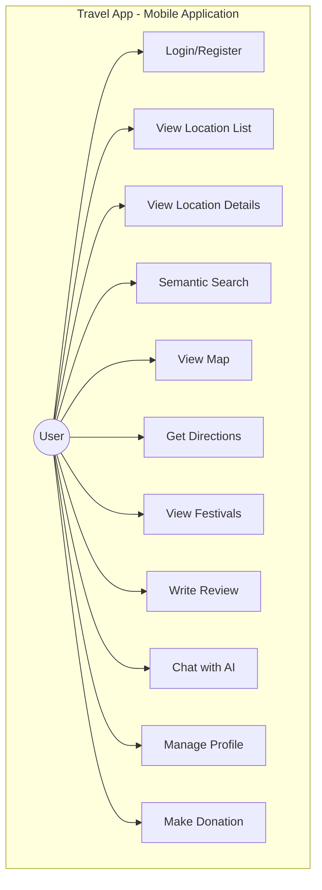

### 3.2.2 Sơ đồ Use Case - Dashboard quản trị

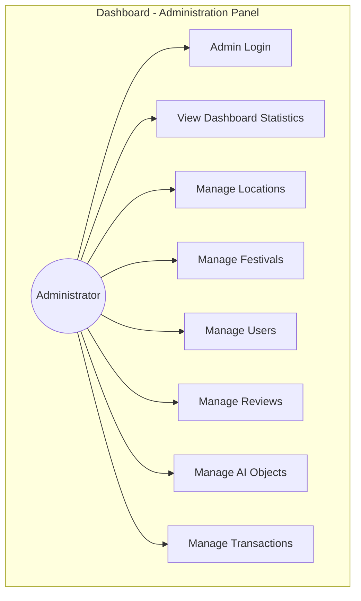

## 3.3 SƠ ĐỒ LỚP (CLASS DIAGRAM)

### 3.3.1 Các thực thể chính

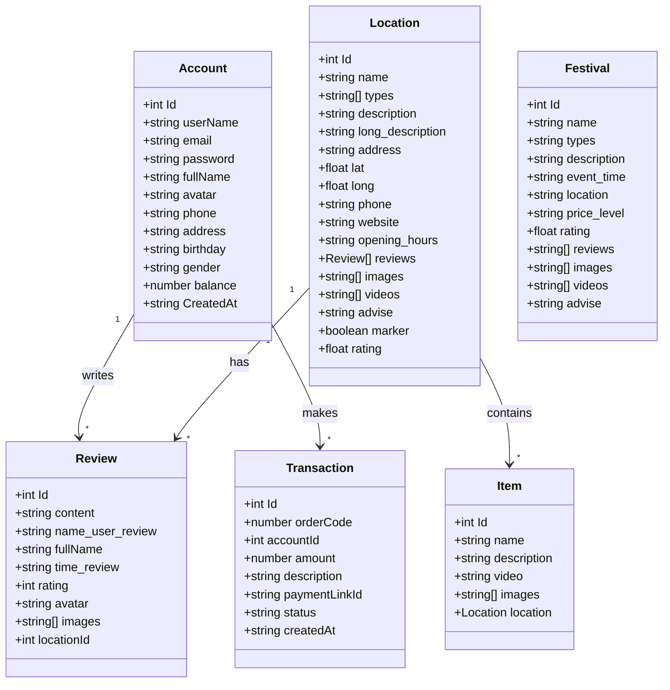

## 3.4 THIẾT KẾ CƠ SỞ DỮ LIỆU

### 3.4.1 ERD (Entity Relationship Diagram)

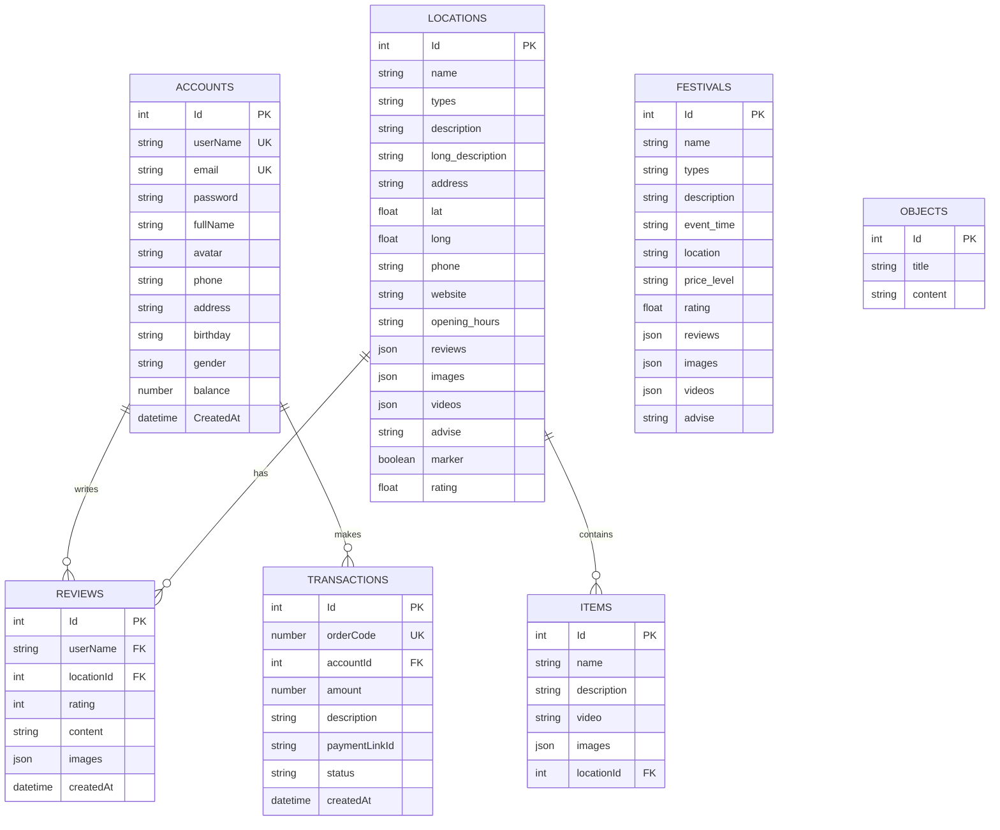

### 3.4.2 Chi tiết các bảng dữ liệu

#### Bảng ACCOUNTS (Tài khoản người dùng)

| Trường   | Kiểu dữ liệu | Mô tả                  | Ràng buộc          |
| -------- | ------------ | ---------------------- | ------------------ |
| Id       | Integer      | Khóa chính             | PK, Auto increment |
| userName | String       | Tên đăng nhập          | Unique, Not null   |
| email    | String       | Địa chỉ email          | Unique, Not null   |
| password | String       | Mật khẩu (SHA256 hash) | Not null           |
| fullName | String       | Họ và tên              |                    |
| avatar   | String       | URL ảnh đại diện       |                    |
| phone    | String       | Số điện thoại          |                    |
| address  | String       | Địa chỉ                |                    |
| birthday | String       | Ngày sinh              |                    |
| gender   | String       | Giới tính              |                    |
| balance  | Number       | Số dư tài khoản        | Default: 0         |

#### Bảng LOCATIONS (Điểm du lịch)

| Trường           | Kiểu dữ liệu | Mô tả                  | Ràng buộc          |
| ---------------- | ------------ | ---------------------- | ------------------ |
| Id               | Integer      | Khóa chính             | PK, Auto increment |
| name             | String       | Tên địa điểm           | Not null           |
| types            | String       | Loại địa điểm (JSON)   |                    |
| description      | String       | Mô tả ngắn             |                    |
| long_description | String       | Mô tả chi tiết         |                    |
| address          | String       | Địa chỉ                |                    |
| lat              | Float        | Vĩ độ                  |                    |
| long             | Float        | Kinh độ                |                    |
| phone            | String       | Số điện thoại          |                    |
| website          | String       | URL website            |                    |
| opening_hours    | String       | Giờ mở cửa             |                    |
| reviews          | JSON String  | Danh sách đánh giá     |                    |
| images           | JSON String  | Danh sách URL hình ảnh |                    |
| videos           | JSON String  | Danh sách URL video    |                    |
| advise           | String       | Lời khuyên du lịch     |                    |
| marker           | Boolean      | Hiển thị trên bản đồ   | Default: true      |

#### Bảng FESTIVALS (Lễ hội)

| Trường      | Kiểu dữ liệu | Mô tả                  | Ràng buộc          |
| ----------- | ------------ | ---------------------- | ------------------ |
| Id          | Integer      | Khóa chính             | PK, Auto increment |
| name        | String       | Tên lễ hội             | Not null           |
| types       | String       | Loại lễ hội            |                    |
| description | String       | Mô tả                  |                    |
| event_time  | String       | Thời gian sự kiện      |                    |
| location    | String       | Địa điểm tổ chức       |                    |
| price_level | String       | Mức giá                |                    |
| rating      | Float        | Đánh giá trung bình    |                    |
| reviews     | JSON String  | Danh sách đánh giá     |                    |
| images      | JSON String  | Danh sách URL hình ảnh |                    |
| videos      | JSON String  | Danh sách URL video    |                    |
| advise      | String       | Lời khuyên             |                    |

#### Bảng TRANSACTIONS (Giao dịch)

| Trường      | Kiểu dữ liệu | Mô tả         | Ràng buộc                      |
| ----------- | ------------ | ------------- | ------------------------------ |
| Id          | Integer      | Khóa chính    | PK, Auto increment             |
| orderCode   | Number       | Mã đơn PayOS  | Unique                         |
| accountId   | Integer      | ID người dùng | FK -> ACCOUNTS                 |
| amount      | Number       | Số tiền       | Not null                       |
| description | String       | Mô tả         |                                |
| status      | String       | Trạng thái    | PENDING/PAID/CANCELLED/EXPIRED |

#### Bảng OBJECTS (AI Objects)

| Trường  | Kiểu dữ liệu | Mô tả      | Ràng buộc          |
| ------- | ------------ | ---------- | ------------------ |
| Id      | Integer      | Khóa chính | PK, Auto increment |
| title   | String       | Tiêu đề    |                    |
| content | String       | Nội dung   |                    |

## 3.5 KIẾN TRÚC HỆ THỐNG

### 3.5.1 Sơ đồ kiến trúc tổng quan

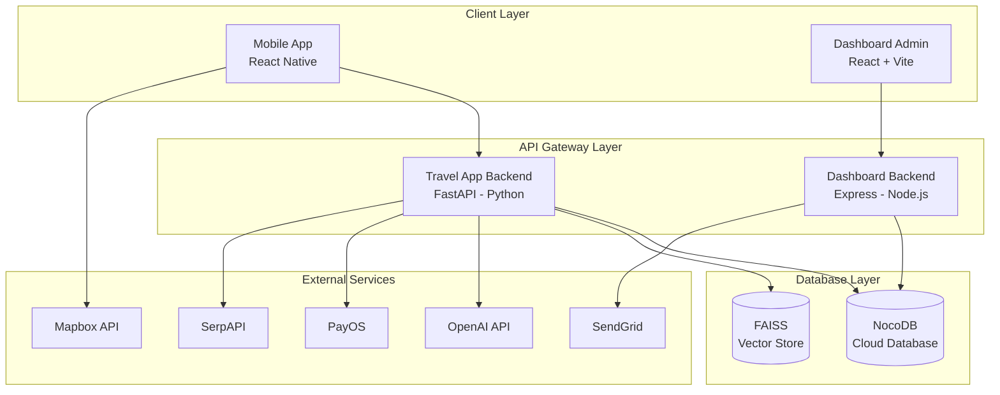

### 3.5.2 Luồng xử lý Tìm kiếm ngữ nghĩa

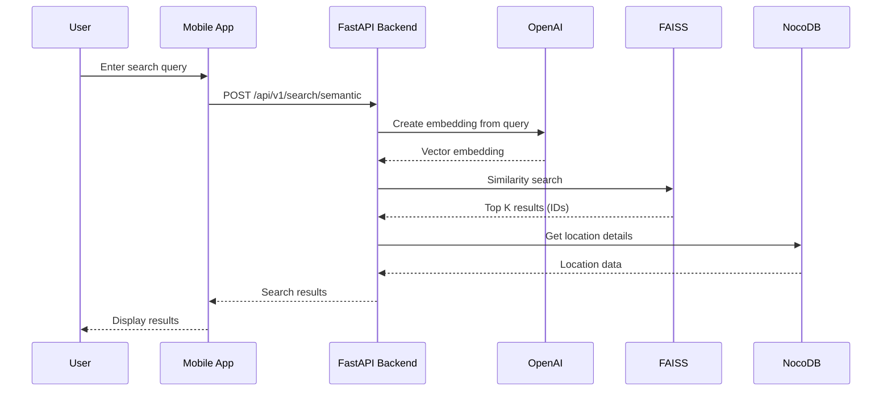

### 3.5.3 Luồng xử lý RAG Chatbot

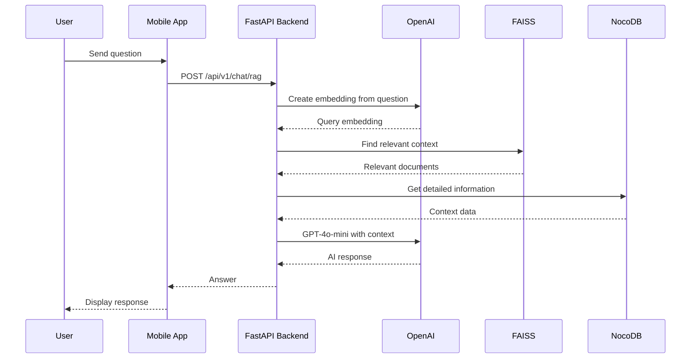

### 3.5.4 Luồng xử lý Xác thực người dùng

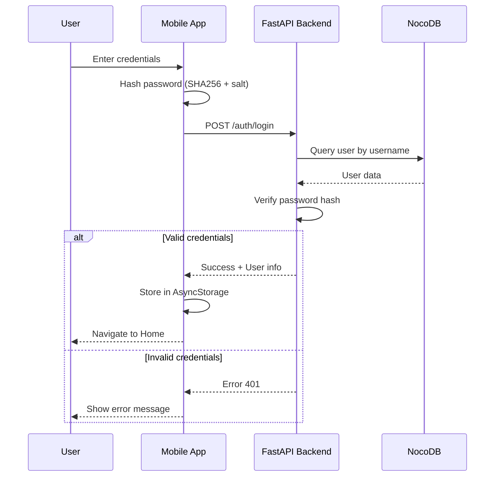

### 3.5.5 Luồng xử lý Thanh toán/Quyên góp

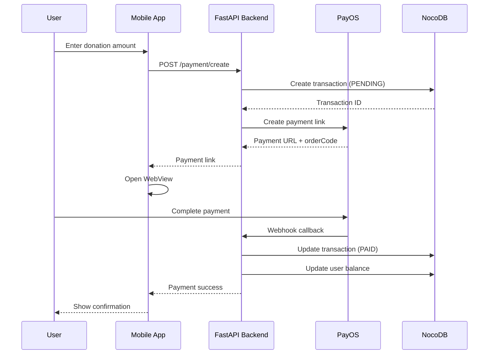

### 3.5.6 Luồng xử lý Tạo đánh giá

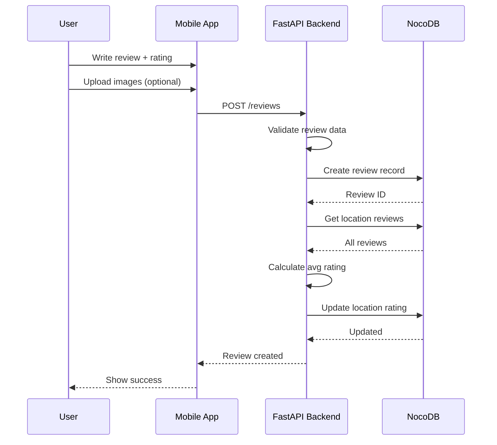

## 3.6 SƠ ĐỒ THÀNH PHẦN (COMPONENT DIAGRAM)

### 3.6.1 Sơ đồ thành phần hệ thống

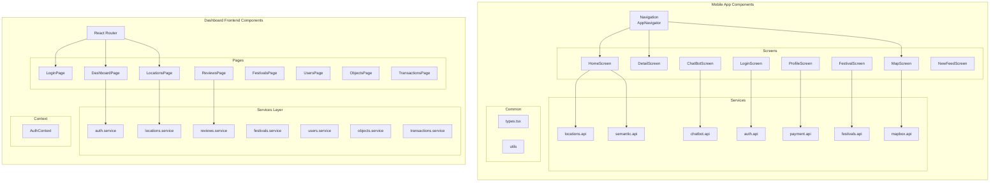

### 3.6.2 Sơ đồ thành phần Backend

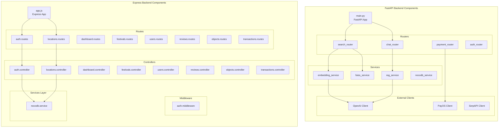

# CHƯƠNG 4: XÂY DỰNG VÀ TRIỂN KHAI

## 4.1 ỨNG DỤNG DI ĐỘNG (TRAVEL APP)

### 4.1.1 Cấu trúc thư mục

```
Travel/
├── src/
│   ├── common/
│   │   ├── types.tsx          # TypeScript interfaces
│   │   └── ...
│   ├── container/
│   │   └── screens/
│   │       ├── Home/
│   │       │   ├── HomeScreen.tsx
│   │       │   └── DetailLocationScreen.tsx
│   │       ├── Maps/
│   │       │   └── MapScreenV2.tsx
│   │       ├── Festival/
│   │       │   ├── FestivalsScreen.tsx
│   │       │   └── DetailFestivalScreen.tsx
│   │       ├── NewFeed/
│   │       │   └── NewFeedScreen.tsx
│   │       ├── Profile/
│   │       │   ├── ProfileScreen.tsx
│   │       │   └── ChatBotScreen.tsx
│   │       ├── Login/
│   │       │   ├── LoginScreen.tsx
│   │       │   ├── SignUpScreen.tsx
│   │       │   └── ForgotPasswordScreen.tsx
│   │       └── Camera/
│   │           └── CameraScreen.tsx
│   ├── services/
│   │   ├── locations.api.ts   # Location API với caching
│   │   ├── semantic.api.ts    # Semantic search API
│   │   ├── chatbot.api.ts     # OpenAI chatbot API
│   │   ├── auth.api.ts        # Authentication API
│   │   ├── payment.api.ts     # PayOS integration
│   │   ├── festivals.api.ts   # Festival API
│   │   └── mapbox.api.ts      # Mapbox directions
│   └── navigation/
│       └── AppNavigator.tsx
├── package.json
└── app.json
```

### 4.1.2 Các màn hình chính

#### A. Màn hình Đăng nhập (LoginScreen)

**Chức năng:**

- Form đăng nhập với username và password
- Validation input
- Mã hóa password với SHA256 + salt
- Lưu thông tin user vào AsyncStorage
- Chuyển hướng đến Home sau khi đăng nhập thành công

**Code snippet - Xử lý đăng nhập:**

```typescript
const handleLogin = async () => {
  const hashedPassword = CryptoJS.SHA256(
    password + 'travel_app_salt',
  ).toString();
  const response = await authApi.login(username, hashedPassword);
  if (response.success) {
    await AsyncStorage.setItem('user', JSON.stringify(response.user));
    navigation.navigate('Home');
  }
};
```

#### B. Màn hình Trang chủ (HomeScreen)

**Chức năng:**

- Hiển thị danh sách địa điểm phổ biến (horizontal scroll)
- Hiển thị địa điểm gần bạn (sắp xếp theo GPS)
- Widget gợi ý AI
- Thanh tìm kiếm ngữ nghĩa
- Pull-to-refresh

**Tính năng caching:**

- Cache locations trong 10 phút
- In-memory cache với timestamp
- Tự động refresh khi cache hết hạn

#### C. Màn hình Chi tiết địa điểm (DetailLocationScreen)

**Chức năng:**

- Hiển thị thông tin chi tiết: tên, địa chỉ, mô tả
- Gallery hình ảnh với swiper
- Video YouTube embedded
- Danh sách đánh giá
- Nút chỉ đường đến địa điểm
- Nút gọi điện, mở website

#### D. Màn hình Bản đồ (MapScreenV2)

**Chức năng:**

- Hiển thị bản đồ Mapbox với markers
- Chỉ đường từ vị trí hiện tại đến điểm đến
- Thay đổi style bản đồ (Satellite, Outdoors, Dark)
- Text-to-Speech đọc hướng dẫn
- Traffic layer
- Zoom controls

**Tích hợp Mapbox:**

```typescript
const getDirections = async (
  start: [number, number],
  end: [number, number],
) => {
  const response = await mapboxApi.getDirections(start, end, 'driving');
  setRoute(response.routes[0].geometry);
  setInstructions(response.routes[0].legs[0].steps);
};
```

#### E. Màn hình Chatbot AI (ChatBotScreen)

**Chức năng:**

- Chat interface với AI
- Gửi tin nhắn và nhận phản hồi
- Hiển thị suggested actions
- Tìm kiếm hình ảnh theo yêu cầu
- RAG-enhanced responses

**Tích hợp OpenAI:**

```typescript
const sendMessage = async (message: string) => {
  const response = await chatbotApi.sendMessage(message, conversationHistory);
  setMessages([...messages, {role: 'assistant', content: response.reply}]);
};
```

### 4.1.3 API Services

#### A. Location API (locations.api.ts)

```typescript
// Caching implementation
const CACHE_DURATION = 10 * 60 * 1000; // 10 minutes
let locationsCache: {data: ILocation[]; timestamp: number} | null = null;

export const getLocations = async (): Promise<ILocation[]> => {
  if (
    locationsCache &&
    Date.now() - locationsCache.timestamp < CACHE_DURATION
  ) {
    return locationsCache.data;
  }
  const response = await axios.get(`${API_URL}/locations`);
  locationsCache = {data: response.data, timestamp: Date.now()};
  return response.data;
};
```

#### B. Semantic Search API (semantic.api.ts)

```typescript
export const semanticSearch = async (query: string): Promise<ILocation[]> => {
  const response = await axios.post(`${AI_API_URL}/api/v1/search/semantic`, {
    query,
    top_k: 10,
  });
  return response.data.results;
};

export const ragChat = async (
  message: string,
  history: Message[],
): Promise<string> => {
  const response = await axios.post(`${AI_API_URL}/api/v1/chat/rag`, {
    message,
    conversation_history: history,
  });
  return response.data.response;
};
```

#### C. Payment API (payment.api.ts)

```typescript
export const createPayment = async (
  amount: number,
  userName: string,
): Promise<PaymentLink> => {
  const response = await axios.post(`${API_URL}/payment/create`, {
    amount,
    userName,
    description: `Donation from ${userName}`,
  });
  return response.data;
};
```

## 4.2 DASHBOARD QUẢN TRỊ

### 4.2.1 Cấu trúc thư mục Frontend

```
travel-admin-frontend/
├── src/
│   ├── pages/
│   │   ├── DashboardPage.tsx
│   │   ├── LoginPage.tsx
│   │   ├── LocationsPage.tsx
│   │   ├── FestivalsPage.tsx
│   │   ├── ReviewsPage.tsx
│   │   ├── UsersPage.tsx
│   │   ├── ObjectsPage.tsx
│   │   └── TransactionsPage.tsx
│   ├── services/
│   │   ├── auth.service.ts
│   │   ├── locations.service.ts
│   │   ├── festivals.service.ts
│   │   ├── users.service.ts
│   │   ├── reviews.service.ts
│   │   ├── objects.service.ts
│   │   └── transactions.service.ts
│   ├── types/
│   │   └── index.ts
│   ├── contexts/
│   │   └── AuthContext.tsx
│   ├── components/
│   │   └── ProtectedRoute.tsx
│   └── App.tsx
├── package.json
└── vite.config.ts
```

### 4.2.2 Cấu trúc thư mục Backend

```
travel-admin-backend/
├── src/
│   ├── config/
│   │   └── index.js           # NocoDB configuration
│   ├── routes/
│   │   ├── index.js           # Route mounting
│   │   ├── auth.routes.js
│   │   ├── dashboard.routes.js
│   │   ├── locations.routes.js
│   │   ├── festivals.routes.js
│   │   ├── reviews.routes.js
│   │   ├── users.routes.js
│   │   ├── objects.routes.js
│   │   └── transactions.routes.js
│   ├── controllers/
│   │   ├── auth.controller.js
│   │   ├── dashboard.controller.js
│   │   ├── locations.controller.js
│   │   ├── festivals.controller.js
│   │   ├── reviews.controller.js
│   │   ├── users.controller.js
│   │   ├── objects.controller.js
│   │   └── transactions.controller.js
│   ├── middlewares/
│   │   └── auth.middleware.js
│   ├── services/
│   │   └── nocodb.service.js
│   └── app.js
├── package.json
└── .env
```

### 4.2.3 Các trang Dashboard

#### A. Trang Đăng nhập (LoginPage)

**Chức năng:**

- Form đăng nhập admin
- JWT authentication
- Lưu token vào localStorage
- Redirect đến Dashboard

**Xử lý đăng nhập:**

```typescript
const handleLogin = async (values: {username: string; password: string}) => {
  const response = await authService.login(values.username, values.password);
  if (response.token) {
    localStorage.setItem('token', response.token);
    navigate('/dashboard');
  }
};
```

#### B. Trang Dashboard (DashboardPage)

**Chức năng:**

- Hiển thị thống kê tổng quan
- Cards: Tổng locations, festivals, users, reviews
- Biểu đồ thống kê
- Quick actions

#### C. Trang Quản lý Địa điểm (LocationsPage)

**Chức năng:**

- Bảng danh sách với Ant Design Table
- Pagination, sorting, filtering
- Modal thêm/sửa địa điểm
- Xóa địa điểm với confirmation
- Toggle marker hiển thị trên bản đồ

**CRUD Operations:**

```typescript
// Get all locations
const fetchLocations = async () => {
  const data = await locationsService.getAll();
  setLocations(data);
};

// Create location
const handleCreate = async (values: Location) => {
  await locationsService.create(values);
  fetchLocations();
};

// Update location
const handleUpdate = async (id: number, values: Location) => {
  await locationsService.update(id, values);
  fetchLocations();
};

// Delete location
const handleDelete = async (id: number) => {
  await locationsService.delete(id);
  fetchLocations();
};
```

#### D. Trang Quản lý Người dùng (UsersPage)

**Chức năng:**

- Danh sách tất cả users
- Thêm user mới với password hash
- Chỉnh sửa thông tin user
- Xóa user

**Password Hashing:**

```javascript
// Backend - users.controller.js
const createUser = async (req, res) => {
  const {password, ...userData} = req.body;
  const hashedPassword = CryptoJS.SHA256(
    password + 'travel_app_salt',
  ).toString();
  const user = await nocodbService.create('accounts', {
    ...userData,
    password: hashedPassword,
  });
  res.json(user);
};
```

### 4.2.4 API Endpoints

#### Dashboard Backend Routes

| Method | Endpoint              | Mô tả                    |
| ------ | --------------------- | ------------------------ |
| POST   | /auth/login           | Đăng nhập admin          |
| GET    | /dashboard/stats      | Lấy thống kê             |
| GET    | /locations            | Lấy danh sách địa điểm   |
| POST   | /locations            | Tạo địa điểm mới         |
| PUT    | /locations/:id        | Cập nhật địa điểm        |
| DELETE | /locations/:id        | Xóa địa điểm             |
| PATCH  | /locations/:id/marker | Toggle marker            |
| GET    | /festivals            | Lấy danh sách lễ hội     |
| POST   | /festivals            | Tạo lễ hội mới           |
| PUT    | /festivals/:id        | Cập nhật lễ hội          |
| DELETE | /festivals/:id        | Xóa lễ hội               |
| GET    | /users                | Lấy danh sách users      |
| POST   | /users                | Tạo user mới             |
| PUT    | /users/:id            | Cập nhật user            |
| DELETE | /users/:id            | Xóa user                 |
| GET    | /reviews              | Lấy danh sách reviews    |
| DELETE | /reviews/:id          | Xóa review               |
| GET    | /objects              | Lấy danh sách AI objects |
| POST   | /objects              | Tạo AI object            |
| PUT    | /objects/:id          | Cập nhật AI object       |
| DELETE | /objects/:id          | Xóa AI object            |
| GET    | /transactions         | Lấy danh sách giao dịch  |

#### Travel App Backend Routes (AI Server)

| Method | Endpoint                         | Mô tả              |
| ------ | -------------------------------- | ------------------ |
| POST   | /api/v1/search/semantic          | Tìm kiếm ngữ nghĩa |
| POST   | /api/v1/chat/rag                 | Chat với RAG       |
| GET    | /api/v1/recommendations/{userId} | Gợi ý cho user     |
| POST   | /api/v1/memory/store             | Lưu memory         |
| POST   | /api/v1/embeddings/create        | Tạo embeddings     |

## 4.3 TÍCH HỢP AI

### 4.3.1 Semantic Search với FAISS

**Quy trình:**

1. Tạo embeddings cho tất cả locations sử dụng OpenAI text-embedding-ada-002
2. Lưu embeddings vào FAISS index
3. Khi user tìm kiếm, tạo embedding cho query
4. Tìm top-K vectors tương tự trong FAISS
5. Trả về locations tương ứng

**Code Backend (Python):**

```python
# embedding_service.py
async def create_embedding(text: str) -> List[float]:
    response = await openai_client.embeddings.create(
        model="text-embedding-ada-002",
        input=text
    )
    return response.data[0].embedding

# faiss_service.py
def search(query_embedding: List[float], top_k: int = 10) -> List[int]:
    query_vector = np.array([query_embedding]).astype('float32')
    distances, indices = index.search(query_vector, top_k)
    return indices[0].tolist()
```

### 4.3.2 RAG Chatbot

**Quy trình:**

1. Nhận câu hỏi từ user
2. Tạo embedding cho câu hỏi
3. Tìm context liên quan từ FAISS
4. Lấy thông tin chi tiết từ NocoDB
5. Gửi prompt với context đến GPT-4o-mini
6. Trả về câu trả lời

**Code Backend (Python):**

```python
# rag_service.py
async def generate_response(question: str, context: List[dict]) -> str:
    context_text = "\n".join([f"- {item['name']}: {item['description']}" for item in context])

    prompt = f"""Bạn là trợ lý du lịch Đà Nẵng. Dựa trên thông tin sau:

{context_text}

Hãy trả lời câu hỏi: {question}"""

    response = await openai_client.chat.completions.create(
        model="gpt-4o-mini",
        messages=[{"role": "user", "content": prompt}]
    )
    return response.choices[0].message.content
```

## 4.4 BẢO MẬT

### 4.4.1 Authentication

**Mobile App:**

- Password hashing với SHA256 + salt
- Lưu session trong AsyncStorage
- Auto logout khi token hết hạn

**Dashboard:**

- JWT authentication
- Token expiration: 24 giờ
- Protected routes với middleware

### 4.4.2 API Security

- CORS configuration
- Helmet security headers
- Rate limiting
- Input validation

---

# CHƯƠNG 5: KẾT LUẬN VÀ HƯỚNG PHÁT TRIỂN

## 5.1 KẾT QUẢ ĐẠT ĐƯỢC

### 5.1.1 Về mặt kỹ thuật

1. **Ứng dụng di động hoàn chỉnh:**

   - Giao diện thân thiện, responsive
   - Tích hợp bản đồ Mapbox với chỉ đường
   - Tìm kiếm ngữ nghĩa AI
   - Chatbot tư vấn thông minh
   - Hệ thống đánh giá và bình luận

2. **Dashboard quản trị:**

   - Giao diện quản trị chuyên nghiệp với Ant Design
   - CRUD đầy đủ cho tất cả entities
   - Thống kê và biểu đồ
   - Phân quyền admin

3. **Backend services:**
   - API RESTful chuẩn
   - Tích hợp AI với OpenAI và FAISS
   - Xử lý thanh toán với PayOS
   - Bảo mật với JWT và password hashing

### 5.1.2 Về mặt chức năng

- Hiển thị 50+ địa điểm du lịch Đà Nẵng
- Thông tin chi tiết với hình ảnh, video
- Điều hướng và chỉ đường chính xác
- Chatbot AI trả lời câu hỏi về du lịch
- Hệ thống donation hoạt động

## 5.2 HẠN CHẾ

1. **Hiệu năng:**

   - Chưa tối ưu cho dữ liệu lớn
   - Caching chưa hoàn thiện

2. **Tính năng:**

   - Chưa có offline mode
   - Chưa hỗ trợ đa ngôn ngữ hoàn chỉnh
   - Chưa có push notification

3. **Bảo mật:**
   - Chưa implement refresh token
   - Chưa có rate limiting đầy đủ

## 5.3 HƯỚNG PHÁT TRIỂN

### 5.3.1 Ngắn hạn

1. Thêm offline mode với local database
2. Implement push notification
3. Tối ưu hiệu năng và caching
4. Thêm unit tests và integration tests

### 5.3.2 Dài hạn

1. Mở rộng cho các thành phố khác
2. Tích hợp booking khách sạn, tour
3. Social features: follow, share
4. AR (Augmented Reality) cho điểm tham quan
5. Machine Learning để cá nhân hóa gợi ý

---

# PHỤ LỤC

## A. DANH SÁCH CÔNG NGHỆ SỬ DỤNG

| STT | Công nghệ    | Phiên bản       | Mục đích              |
| --- | ------------ | --------------- | --------------------- |
| 1   | React Native | 0.74.2          | Mobile framework      |
| 2   | React        | 18.2.0 / 19.2.0 | UI library            |
| 3   | TypeScript   | 5.9.3           | Type checking         |
| 4   | FastAPI      | 0.108.0+        | Python web framework  |
| 5   | Express      | 4.18.2          | Node.js web framework |
| 6   | NocoDB       | Cloud           | Database              |
| 7   | FAISS        | 1.7.4+          | Vector search         |
| 8   | OpenAI       | GPT-4o-mini     | AI/ML                 |
| 9   | Mapbox       | 10.1.30         | Maps                  |
| 10  | PayOS        | 1.0.0+          | Payment               |
| 11  | Ant Design   | 6.0.1           | UI components         |
| 12  | Vite         | 7.2.4           | Build tool            |

## B. CẤU HÌNH MÔI TRƯỜNG

### Travel App Backend (.env)

```
OPENAI_API_KEY=sk-xxx
NOCODB_API_URL=https://app.nocodb.com/api/v2
NOCODB_API_TOKEN=xxx
PAYOS_CLIENT_ID=xxx
PAYOS_API_KEY=xxx
PAYOS_CHECKSUM_KEY=xxx
```

### Dashboard Backend (.env)

```
PORT=3001
NOCODB_API_URL=https://app.nocodb.com/api/v2
NOCODB_API_TOKEN=xxx
JWT_SECRET=xxx
SENDGRID_API_KEY=xxx
```

## C. HƯỚNG DẪN CÀI ĐẶT

### 1. Travel App Frontend

```bash
cd Travel
npm install
npx react-native run-android  # Android
npx react-native run-ios      # iOS
```

### 2. Travel App Backend

```bash
cd freelance-travel-app-server
pip install -r requirements.txt
uvicorn app:app --reload --port 8000
```

### 3. Dashboard Frontend

```bash
cd travel-admin-frontend
npm install
npm run dev
```

### 4. Dashboard Backend

```bash
cd travel-admin-backend
npm install
npm run dev
```

---

# TÀI LIỆU THAM KHẢO

1. React Native Documentation - https://reactnative.dev/docs/getting-started
2. FastAPI Documentation - https://fastapi.tiangolo.com/
3. OpenAI API Documentation - https://platform.openai.com/docs
4. FAISS Documentation - https://faiss.ai/
5. Mapbox Documentation - https://docs.mapbox.com/
6. NocoDB Documentation - https://docs.nocodb.com/
7. Ant Design Documentation - https://ant.design/
8. PayOS Documentation - https://payos.vn/docs/

---

_Báo cáo được tạo tự động dựa trên phân tích mã nguồn thực tế của hệ thống._
_Ngày tạo: 09/12/2024_
