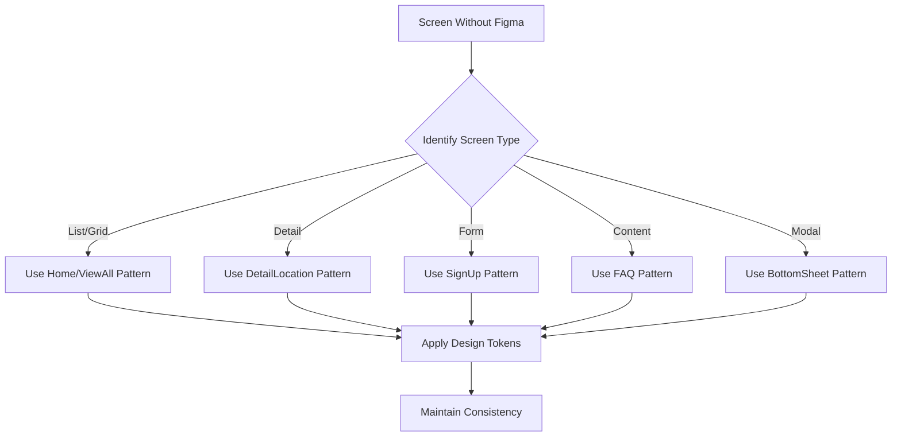

# 🎨 Travel React Native App - UI Rebuild Implementation Plan

> **Document Version:** 1.0  
> **Created:** December 15, 2024  
> **Project:** Travel Da Nang Mobile App  
> **Platform:** React Native (iOS & Android)

---

## 📑 Table of Contents

1. [Executive Summary](#1-executive-summary)
2. [Current Architecture Analysis](#2-current-architecture-analysis)
3. [Screen Categorization](#3-screen-categorization)
4. [Design System Extraction Plan](#4-design-system-extraction-plan)
5. [Detailed Implementation Task List](#5-detailed-implementation-task-list)
6. [Risk Assessment and Mitigation](#6-risk-assessment-and-mitigation)
7. [Dependencies and Prerequisites](#7-dependencies-and-prerequisites)
8. [Testing Strategy](#8-testing-strategy)
9. [Next Steps and Decision Points](#9-next-steps-and-decision-points)

---

## 1. Executive Summary

### 1.1 Project Overview

This document outlines the comprehensive plan for rebuilding the UI of the Travel Da Nang React Native mobile application based on Figma design specifications. The rebuild aims to modernize the app's visual appearance while maintaining all existing functionality.

### 1.2 Current State vs. Target State

| Aspect | Current State | Target State |
|--------|---------------|--------------|
| **Design System** | Fragmented styling across components | Centralized theme with design tokens |
| **Color Palette** | Primary green (#2ecc71) with hardcoded colors | Figma-defined color palette |
| **Typography** | GoogleSans/NotoSansJP fonts, inconsistent usage | Standardized typography scale |
| **Components** | Mix of custom and react-native-paper | Unified component library |
| **Styling Approach** | Inline StyleSheet.create() | Centralized theme provider |

### 1.3 Effort Estimation Summary

| Complexity Level | Task Count | Time per Task | Subtotal |
|------------------|------------|---------------|----------|
| 🟢 Low | 18 tasks | 1-2 hours | 18-36 hours |
| 🟡 Medium | 20 tasks | 2-4 hours | 40-80 hours |
| 🔴 High | 7 tasks | 4-8 hours | 28-56 hours |
| **Total** | **45 tasks** | - | **86-172 hours** |

**Estimated Timeline:** 4-8 weeks (depending on team size and availability)

---

## 2. Current Architecture Analysis

### 2.1 Technology Stack

| Technology | Version | Purpose | File Location |
|------------|---------|---------|---------------|
| React Native | 0.74.2 | Mobile framework | `package.json` |
| TypeScript | 4.8.4 | Type-safe JavaScript | `tsconfig.json` |
| React Navigation | 6.x | Navigation (Stack, Bottom Tabs) | `src/container/AppContainer.tsx` |
| react-native-paper | 5.12.5 | UI component library | Various screens |
| react-native-svg | 15.3.0 | SVG icons | `src/assets/ImageSvg.tsx` |
| @rnmapbox/maps | 10.1.31 | Map integration | `src/container/screens/Maps/` |
| react-native-reanimated | 3.12.1 | Animations | Various components |

### 2.2 Navigation Structure

```
Travel App Navigation Hierarchy
├── SwitchNavigator (Root)
│   ├── SplashScreen
│   ├── LoginScreen
│   ├── SignUpScreen
│   ├── ForgotPasswordScreen
│   └── HomeStackScreen (Authenticated)
│       ├── BottomTabNavigator (6 tabs)
│       │   ├── 🏠 Home Tab → HomeScreen
│       │   ├── 🎉 Festival Tab → FestivalsScreen
│       │   ├── 📰 NewFeed Tab → NewFeedScreen
│       │   ├── 🗺️ Map Tab → MapScreenV2
│       │   ├── 📷 Camera Tab → CameraScreen
│       │   └── 👤 Profile Tab → ProfileScreen
│       └── Stack Screens (22 additional screens)
```

**Navigation File:** `src/container/AppContainer.tsx`

### 2.3 Complete Screen Inventory (27 Screens)

#### 2.3.1 Authentication Screens (3 screens)

| # | Screen Name | File Path | Complexity | Key Features |
|---|-------------|-----------|------------|--------------|
| 1 | Login | `src/container/screens/Login/LoginScreen.tsx` | Medium | Swiper banner, TextInput, validation |
| 2 | Sign Up | `src/container/screens/Login/SignUpScreen.tsx` | Medium | Form with validation, gender selection |
| 3 | Forgot Password | `src/container/screens/Login/ForgotPasswordScreen.tsx` | Low | Simple email form |

#### 2.3.2 Home & Location Screens (5 screens)

| # | Screen Name | File Path | Complexity | Key Features |
|---|-------------|-----------|------------|--------------|
| 4 | Home | `src/container/screens/Home/HomeScreen.tsx` | High | Search, recommendations, FlatLists, language dropdown |
| 5 | Detail Location | `src/container/screens/Home/DetailLocation.tsx` | High | Rich content, tabs, reviews, audio guide, video |
| 6 | View All Locations | `src/container/screens/Home/ViewAllLocation.tsx` | Medium | Grid/List toggle, filtering |
| 7 | Location Image | `src/container/screens/Home/LocationImage.tsx` | Low | Image gallery viewer |
| 8 | Location Video | `src/container/screens/Home/LocationVideo.tsx` | Low | Video player |

#### 2.3.3 Festival Screens (3 screens)

| # | Screen Name | File Path | Complexity | Key Features |
|---|-------------|-----------|------------|--------------|
| 9 | Festivals | `src/container/screens/Festival/FestivalsScreen.tsx` | Medium | Semantic search, list view |
| 10 | Detail Festival | `src/container/screens/Festival/DetailFestival.tsx` | Medium | Festival details, images |
| 11 | View All Festivals | `src/container/screens/Festival/ViewAllFestivals.tsx` | Low | Simple list view |

#### 2.3.4 NewFeed/Reviews Screens (3 screens)

| # | Screen Name | File Path | Complexity | Key Features |
|---|-------------|-----------|------------|--------------|
| 12 | NewFeed | `src/container/screens/NewFeed/NewFeedScreen.tsx` | High | Reviews list, add review modal, image upload, location filter |
| 13 | Detail Item | `src/container/screens/NewFeed/DetailItem.tsx` | Medium | Item details view |
| 14 | All Items | `src/container/screens/NewFeed/AllItemsScreen.tsx` | Low | Items list view |

#### 2.3.5 Map Screens (2 screens)

| # | Screen Name | File Path | Complexity | Key Features |
|---|-------------|-----------|------------|--------------|
| 15 | Map | `src/container/screens/Maps/MapScreenV2.tsx` | High | Mapbox integration, directions, markers |
| 16 | Advise | `src/container/screens/Maps/Advise.tsx` | Low | Travel advice content |

#### 2.3.6 Camera Screens (2 screens)

| # | Screen Name | File Path | Complexity | Key Features |
|---|-------------|-----------|------------|--------------|
| 17 | Camera | `src/container/screens/Camera/CameraScreen.tsx` | Medium | Vision camera, capture |
| 18 | Preview Image | `src/container/screens/Camera/PreviewImage.tsx` | Low | Image preview, share |

#### 2.3.7 Profile & Settings Screens (8 screens)

| # | Screen Name | File Path | Complexity | Key Features |
|---|-------------|-----------|------------|--------------|
| 19 | Profile | `src/container/screens/Profile/ProfileScreen.tsx` | Medium | Menu list, avatar, navigation |
| 20 | Personal | `src/container/screens/Profile/Personal.tsx` | Medium | User info form, edit profile |
| 21 | Settings | `src/container/screens/Profile/Settings.tsx` | Low | Settings options |
| 22 | FAQ | `src/container/screens/Profile/FAQ.tsx` | Low | FAQ accordion list |
| 23 | Policy | `src/container/screens/Profile/Policy.tsx` | Low | Policy markdown content |
| 24 | About | `src/container/screens/Profile/About.tsx` | Low | App info, version |
| 25 | Donation | `src/container/screens/Profile/Donation.tsx` | Low | QR code, donation info |
| 26 | Chatbot | `src/container/screens/Profile/ChatbotScreen.tsx` | High | AI chat interface, image upload |

#### 2.3.8 Other Screens (1 screen)

| # | Screen Name | File Path | Complexity | Key Features |
|---|-------------|-----------|------------|--------------|
| 27 | Search | `src/container/screens/Search/SearchScreen.tsx` | Medium | Search results display |

### 2.4 Current UI Component Inventory

#### 2.4.1 Base Components (`src/component/`)

| Component | File | Purpose | Reusability | Notes |
|-----------|------|---------|-------------|-------|
| Page | `Page.tsx` | Base screen container with keyboard dismiss | High | Used by all screens |
| HeaderBase | `HeaderBase.tsx` | Screen header with left/right icons | High | ⚠️ Has hardcoded color `#F97350` |
| ButtonBase | `ButtonBase.tsx` | Reusable button with icons | High | Custom styling |
| InputBase | `InputBase.tsx` | Text input with validation, error display | High | Icon support |
| TextBase | `TextBase.tsx` | Base text with default styling | High | Font family default |
| BottomSheet | `BottomSheet.tsx` | Modal bottom sheet (RBSheet wrapper) | High | Used for forms |

#### 2.4.2 Location/Card Components

| Component | File | Purpose | Dimensions |
|-----------|------|---------|------------|
| BigItemLocation | `BigItemLocation.tsx` | Horizontal location card | 80% width × 160px image |
| LargeItemLocation | `LargeItemLocation.tsx` | List item with image | 25% width image × auto |
| LargeItemFestival | `LargeItemFestival.tsx` | Festival list item | Similar to LargeItemLocation |
| HistoricalArtifact | `HistoricalArtifact.tsx` | Artifact card | Custom layout |
| ReviewItem | `ReviewItem.tsx` | Review with images, stars, modal | Full width |

#### 2.4.3 Search Components

| Component | File | Purpose | Features |
|-----------|------|---------|----------|
| SearchBarComponent | `SearchBarComponent.tsx` | Basic text search | Debounced search |
| SemanticSearchBarComponent | `SemanticSearchBarComponent.tsx` | AI-powered semantic search | API integration |

#### 2.4.4 Utility Components

| Component | File | Purpose |
|-----------|------|---------|
| CachedImage | `CachedImage.tsx` | Image with local caching |
| LanguageDropdown | `LanguageDropdown.tsx` | Language selector |
| RecommendationsWidget | `RecommendationsWidget.tsx` | AI recommendations display |
| Avatar | `utils/avatarUtils.tsx` | User avatar display |

### 2.5 Current Styling System

#### 2.5.1 Color Palette (`src/common/colors.tsx`)

```typescript
const colors = {
  // Primary Green Scale
  primary_50: '#f1fcf5',
  primary_100: '#dff9e8',
  primary_200: '#c0f2d2',
  primary: '#2ecc71',      // Main primary color
  primary_950: '#072c18',

  // Backgrounds
  background: '#f7f7f8',

  // Neutrals
  black: '#000000',
  white: '#FFFFFF',
  xam: '#E0E0E0',          // Gray separator
};
```

#### 2.5.2 Typography (`src/common/fonts.tsx` & `src/common/AppStyle.tsx`)

**Font Families:**
- `GoogleSans_Regular` - Primary regular
- `GoogleSans_Medium` - Primary medium
- `GoogleSans_Bold` - Primary bold
- `NotoSansJP_Regular/Medium/Bold` - Japanese support
- `Roboto_Regular/Bold` - Fallback

**Text Styles (AppStyle.tsx):**

| Style Name | Font Size | Font Weight | Usage |
|------------|-----------|-------------|-------|
| txt_12_regular | 12 | Regular | Captions, timestamps |
| txt_14_regular | 14 | Regular | Body secondary |
| txt_14_medium | 14 | Medium | Labels |
| txt_16_regular | 16 | Regular | Body text |
| txt_18_bold | 18 | Bold | Subheadings |
| txt_18_regular | 18 | Regular | Body large |
| txt_20_bold | 20 | Bold | Section headers |
| txt_18_bold_review | 18 | Bold | Review author names |

#### 2.5.3 Sizing System (`src/common/sizes.tsx`)

```typescript
// Pre-calculated responsive sizes based on 414px base width
// Usage: sizes._16sdp (returns scaled 16px value)

const BASE_WIDTH = 414;
const scale = screenWidth / BASE_WIDTH;

// Examples:
sizes._1sdp    // 1 * scale
sizes._8sdp    // 8 * scale
sizes._16sdp   // 16 * scale
sizes._1000sdp // 1000 * scale (used for full border radius)

// Screen dimensions
sizes.width    // Device screen width
sizes.height   // Device screen height
```

### 2.6 Identified Issues and Technical Debt

| Issue | Severity | Location | Description |
|-------|----------|----------|-------------|
| ⚠️ Hardcoded colors | Medium | `HeaderBase.tsx` | Uses `#F97350` instead of theme color |
| ⚠️ Inconsistent components | Medium | Various screens | Mix of react-native-paper and custom components |
| ⚠️ No theme provider | Medium | Global | Styles defined inline in each component |
| ⚠️ Class components | Low | All screens | Uses React.PureComponent instead of functional |
| ⚠️ Verbose sizing | Low | `sizes.tsx` | Pre-calculated values (1103 lines) vs. dynamic function |
| ⚠️ Mixed styling patterns | Medium | Various | Some screens use paper components, others custom |

---

## 3. Screen Categorization

### 3.1 Category A: Screens WITH Figma Designs (Assumed)

Based on typical travel app Figma design deliverables, these screens are expected to have complete designs:

#### Priority P0 (Critical - Core User Journey)

| Screen | Current File | Design Priority | Reason |
|--------|--------------|-----------------|--------|
| ✅ Splash Screen | `SplashScreen.tsx` | P0 | Brand identity, first impression |
| ✅ Login Screen | `Login/LoginScreen.tsx` | P0 | Core authentication flow |
| ✅ Sign Up Screen | `Login/SignUpScreen.tsx` | P0 | User registration flow |
| ✅ Home Screen | `Home/HomeScreen.tsx` | P0 | Main landing page, app hub |

#### Priority P1 (High - Key Features)

| Screen | Current File | Design Priority | Reason |
|--------|--------------|-----------------|--------|
| ✅ Detail Location | `Home/DetailLocation.tsx` | P1 | Core content viewing |
| ✅ Profile Screen | `Profile/ProfileScreen.tsx` | P1 | User identity & settings |
| ✅ Map Screen | `Maps/MapScreenV2.tsx` | P1 | Core navigation feature |
| ✅ NewFeed Screen | `NewFeed/NewFeedScreen.tsx` | P1 | User-generated content |

#### Priority P2 (Medium - Secondary Features)

| Screen | Current File | Design Priority | Reason |
|--------|--------------|-----------------|--------|
| ✅ Festivals Screen | `Festival/FestivalsScreen.tsx` | P2 | Feature discovery |
| ✅ Chatbot Screen | `Profile/ChatbotScreen.tsx` | P2 | AI assistant feature |
| ✅ Personal (Edit Profile) | `Profile/Personal.tsx` | P2 | User settings |

### 3.2 Category B: Screens WITHOUT Figma Designs

These screens will be designed by following patterns from Category A screens:

| Screen | Pattern Source | Approach |
|--------|----------------|----------|
| Forgot Password | → Login Screen | Same form layout, reduced fields |
| View All Locations | → Home Screen | Same card components in grid layout |
| Location Image | → Detail Location | Minimal chrome, focus on media |
| Location Video | → Detail Location | Video player with consistent controls |
| Detail Festival | → Detail Location | Same detail layout structure |
| View All Festivals | → View All Locations | Same list/grid pattern |
| Detail Item | → Detail Location | Same detail layout structure |
| All Items | → View All Locations | Same list/grid pattern |
| Advise | → FAQ Screen | Content page with sections |
| Camera | → System UI | Minimal overlay on camera |
| Preview Image | → Location Image | Consistent media viewer |
| Settings | → Profile Screen | Same menu item pattern |
| FAQ | → Profile Screen | Accordion list pattern |
| Policy | → FAQ Screen | Content page with markdown |
| About | → FAQ Screen | Content page pattern |
| Donation | → FAQ Screen | Content with QR code |
| Search | → View All Locations | Results list with same cards |

---

## 4. Design System Extraction Plan

### 4.1 Design Tokens to Extract from Figma

When Figma designs are provided, extract the following tokens:

#### 4.1.1 Colors

| Token Category | Examples | File to Update |
|----------------|----------|----------------|
| Primary Colors | primary, primary-dark, primary-light | `src/common/colors.tsx` |
| Secondary Colors | secondary, accent | `src/common/colors.tsx` |
| Semantic Colors | success, error, warning, info | `src/common/colors.tsx` |
| Background Colors | bg-primary, bg-secondary, bg-surface | `src/common/colors.tsx` |
| Text Colors | text-primary, text-secondary, text-muted | `src/common/colors.tsx` |
| Border Colors | border-default, border-focus, border-error | `src/common/colors.tsx` |

#### 4.1.2 Typography

| Token Category | Properties | File to Update |
|----------------|------------|----------------|
| Font Families | primary, secondary, monospace | `src/common/fonts.tsx` |
| Font Sizes | xs(10), sm(12), md(14), lg(16), xl(18), 2xl(20), 3xl(24) | `src/common/AppStyle.tsx` |
| Font Weights | regular(400), medium(500), semibold(600), bold(700) | `src/common/AppStyle.tsx` |
| Line Heights | tight(1.25), normal(1.5), relaxed(1.75) | `src/common/AppStyle.tsx` |

#### 4.1.3 Spacing

| Token Category | Scale | Usage |
|----------------|-------|-------|
| spacing-xs | 4px | Tight spacing |
| spacing-sm | 8px | Small gaps |
| spacing-md | 16px | Default spacing |
| spacing-lg | 24px | Section spacing |
| spacing-xl | 32px | Large gaps |
| spacing-2xl | 48px | Page margins |

#### 4.1.4 Border Radius

| Token Category | Value | Usage |
|----------------|-------|-------|
| radius-sm | 4px | Small elements, tags |
| radius-md | 8px | Buttons, inputs |
| radius-lg | 16px | Cards, modals |
| radius-xl | 24px | Large cards |
| radius-full | 9999px | Pills, avatars |

#### 4.1.5 Shadows

| Token Category | Properties | Usage |
|----------------|------------|-------|
| shadow-sm | 0 1px 2px rgba(0,0,0,0.05) | Subtle elevation |
| shadow-md | 0 4px 6px rgba(0,0,0,0.1) | Cards |
| shadow-lg | 0 10px 15px rgba(0,0,0,0.1) | Modals, dropdowns |

### 4.2 Theme Configuration Structure

Create new theme file: `src/theme/index.ts`

```typescript
// src/theme/index.ts
export const theme = {
  colors: {
    primary: {
      50: '#f1fcf5',
      100: '#dff9e8',
      200: '#c0f2d2',
      500: '#2ecc71',  // Default
      900: '#072c18',
    },
    // ... more colors
  },
  typography: {
    fontFamily: {
      primary: 'GoogleSans',
      secondary: 'NotoSansJP',
    },
    fontSize: {
      xs: 10,
      sm: 12,
      md: 14,
      lg: 16,
      xl: 18,
      '2xl': 20,
      '3xl': 24,
    },
    // ... more typography
  },
  spacing: {
    xs: 4,
    sm: 8,
    md: 16,
    lg: 24,
    xl: 32,
  },
  borderRadius: {
    sm: 4,
    md: 8,
    lg: 16,
    full: 9999,
  },
  shadows: {
    sm: { /* shadow properties */ },
    md: { /* shadow properties */ },
    lg: { /* shadow properties */ },
  },
};
```

### 4.3 Application Strategy for Screens Without Figma



---

## 5. Detailed Implementation Task List

### Phase 0: Preparation (Prerequisites)

> **Goal:** Establish foundation before any UI changes

| Task ID | Task Name | Description | Complexity | Est. Time | Dependencies | Files to Modify |
|---------|-----------|-------------|------------|-----------|--------------|-----------------|
| 0.1 | Receive Figma Designs | Obtain design specifications/screenshots from stakeholders | - | - | External | - |
| 0.2 | Extract Design Tokens | Document all colors, typography, spacing, shadows from Figma | Medium | 4h | 0.1 | Documentation |
| 0.3 | Create Theme File | Create centralized theme configuration | Medium | 3h | 0.2 | `src/theme/index.ts` (new) |
| 0.4 | Update Colors | Update color palette based on Figma | Low | 1h | 0.2 | `src/common/colors.tsx` |
| 0.5 | Update Typography | Update font styles and text presets | Low | 2h | 0.2 | `src/common/fonts.tsx`, `src/common/AppStyle.tsx` |
| 0.6 | Create Spacing Constants | Add spacing scale constants | Low | 1h | 0.2 | `src/common/spacing.tsx` (new) |

**Phase 0 Acceptance Criteria:**
- [ ] Design tokens documented in `src/theme/index.ts`
- [ ] Colors.tsx updated with new palette
- [ ] Typography scale implemented
- [ ] Spacing constants created

---

### Phase 1: Core Components (Foundation)

> **Goal:** Update reusable components that are used across multiple screens

| Task ID | Task Name | Description | Complexity | Est. Time | Dependencies | Files to Modify |
|---------|-----------|-------------|------------|-----------|--------------|-----------------|
| 1.1 | Redesign ButtonBase | Update button styles, variants (primary, secondary, outline) | Medium | 3h | Phase 0 | `src/component/ButtonBase.tsx` |
| 1.2 | Redesign InputBase | Update input styles, focus states, error states | Medium | 3h | Phase 0 | `src/component/InputBase.tsx` |
| 1.3 | Redesign HeaderBase | Update header layout, remove hardcoded colors, add variants | Medium | 3h | Phase 0 | `src/component/HeaderBase.tsx` |
| 1.4 | Update TextBase | Update default font, add variants | Low | 1h | Phase 0 | `src/common/TextBase.tsx` |
| 1.5 | Create Card Component | New unified card component for locations, festivals, items | Medium | 4h | Phase 0 | `src/component/Card.tsx` (new) |
| 1.6 | Update BottomSheet | Update modal styling, handle bar, backdrop | Medium | 2h | Phase 0 | `src/component/BottomSheet.tsx` |
| 1.7 | Create Icon Components | Standardize icon usage with consistent sizing | Medium | 2h | Phase 0 | `src/component/Icon.tsx` (new) |

**Phase 1 Acceptance Criteria:**
- [ ] All base components use theme colors
- [ ] No hardcoded color values in components
- [ ] Components have consistent padding/margin
- [ ] Components support dark mode (future-proof)

**Files Modified in Phase 1:**
```
src/component/
├── ButtonBase.tsx      ✏️ Modified
├── InputBase.tsx       ✏️ Modified
├── HeaderBase.tsx      ✏️ Modified
├── BottomSheet.tsx     ✏️ Modified
├── Card.tsx            🆕 New
└── Icon.tsx            🆕 New
src/common/
└── TextBase.tsx        ✏️ Modified
```

---

### Phase 2: Authentication Screens

> **Goal:** Rebuild login flow screens with Figma designs

| Task ID | Task Name | Description | Complexity | Est. Time | Dependencies | Files to Modify |
|---------|-----------|-------------|------------|-----------|--------------|-----------------|
| 2.1 | Rebuild Splash Screen | New splash with logo animation (if designed) | Low | 2h | Phase 1 | `src/container/screens/SplashScreen.tsx` |
| 2.2 | Rebuild Login Screen | Complete UI rebuild based on Figma | Medium | 4h | Phase 1 | `src/container/screens/Login/LoginScreen.tsx` |
| 2.3 | Rebuild Sign Up Screen | Form layout, field styling, validation UI | Medium | 4h | Phase 1 | `src/container/screens/Login/SignUpScreen.tsx` |
| 2.4 | Update Forgot Password | Follow Login screen patterns | Low | 2h | 2.2 | `src/container/screens/Login/ForgotPasswordScreen.tsx` |

**Task 2.2 Detailed Breakdown:**
```
LoginScreen.tsx Changes:
├── Banner/Header Section
│   ├── Update Swiper styling
│   ├── New indicator design
│   └── Gradient overlay (if designed)
├── Form Section
│   ├── Email input with new InputBase
│   ├── Password input with visibility toggle
│   └── Error message styling
├── Action Section
│   ├── Login button with new ButtonBase
│   ├── Forgot password link styling
│   └── Sign up CTA section
└── Social Login (if designed)
    ├── Google login button
    └── Apple login button
```

**Phase 2 Acceptance Criteria:**
- [ ] Login screen matches Figma pixel-perfectly
- [ ] Sign Up form has proper validation states
- [ ] Keyboard avoidance works correctly
- [ ] Loading states implemented
- [ ] Error states match design

---

### Phase 3: Home & Location Screens

> **Goal:** Rebuild main content discovery screens

| Task ID | Task Name | Description | Complexity | Est. Time | Dependencies | Files to Modify |
|---------|-----------|-------------|------------|-----------|--------------|-----------------|
| 3.1 | Rebuild Home Screen | Header, search, sections, recommendations | High | 8h | Phase 1 | `src/container/screens/Home/HomeScreen.tsx` |
| 3.2 | Redesign BigItemLocation | Horizontal card with new styling | Medium | 3h | Phase 1 | `src/component/BigItemLocation.tsx` |
| 3.3 | Redesign LargeItemLocation | List item card with new styling | Medium | 3h | Phase 1 | `src/component/LargeItemLocation.tsx` |
| 3.4 | Rebuild Detail Location | Tabs, content sections, reviews, actions | High | 8h | 3.2, 3.3 | `src/container/screens/Home/DetailLocation.tsx` |
| 3.5 | Rebuild View All Locations | Grid/list toggle, filtering UI | Medium | 4h | 3.2, 3.3 | `src/container/screens/Home/ViewAllLocation.tsx` |
| 3.6 | Update Location Image | Gallery viewer styling | Low | 2h | 3.4 | `src/container/screens/Home/LocationImage.tsx` |
| 3.7 | Update Location Video | Video player UI | Low | 2h | 3.4 | `src/container/screens/Home/LocationVideo.tsx` |

**Task 3.1 Detailed Breakdown:**
```
HomeScreen.tsx Changes:
├── Header Section
│   ├── Greeting text styling
│   ├── Language dropdown redesign
│   └── Profile avatar (if added)
├── Search Section
│   ├── SemanticSearchBar redesign
│   ├── Search suggestions dropdown
│   └── Voice search icon (if designed)
├── Recommendations Section
│   ├── RecommendationsWidget redesign
│   ├── Section header with "View All"
│   └── Horizontal scroll indicators
├── Popular Locations Section
│   ├── Section header styling
│   ├── BigItemLocation horizontal FlatList
│   └── Load more indicator
└── Nearby Locations Section
    ├── Section header styling
    ├── LargeItemLocation vertical list
    └── Distance badge styling
```

**Phase 3 Acceptance Criteria:**
- [ ] Home screen sections match Figma layout
- [ ] Location cards display correctly
- [ ] Pull-to-refresh works with new styling
- [ ] Scroll performance is smooth (60fps)
- [ ] Empty states designed

---

### Phase 4: Map & Navigation Screens

> **Goal:** Update map UI while preserving Mapbox functionality

| Task ID | Task Name | Description | Complexity | Est. Time | Dependencies | Files to Modify |
|---------|-----------|-------------|------------|-----------|--------------|-----------------|
| 4.1 | Rebuild Map Screen UI | Search bar, markers, bottom sheet, directions panel | High | 6h | Phase 1 | `src/container/screens/Maps/MapScreenV2.tsx` |
| 4.2 | Update Advise Screen | Travel advice content layout | Low | 2h | 4.1 | `src/container/screens/Maps/Advise.tsx` |

**Task 4.1 Detailed Breakdown:**
```
MapScreenV2.tsx Changes:
├── Map Overlay Elements
│   ├── Search bar redesign
│   ├── Filter buttons styling
│   └── My location button
├── Map Markers
│   ├── Custom marker design
│   ├── Selected marker state
│   └── Cluster markers
├── Bottom Sheet
│   ├── Location preview card
│   ├── Direction summary
│   └── Action buttons
└── Directions Panel
    ├── Route summary styling
    ├── Turn-by-turn instructions
    └── ETA display
```

**Phase 4 Acceptance Criteria:**
- [ ] Map controls match Figma design
- [ ] Bottom sheet animations smooth
- [ ] Markers visible and tappable
- [ ] Directions panel clear and readable

---

### Phase 5: Festival Screens

> **Goal:** Rebuild festival discovery and detail screens

| Task ID | Task Name | Description | Complexity | Est. Time | Dependencies | Files to Modify |
|---------|-----------|-------------|------------|-----------|--------------|-----------------|
| 5.1 | Rebuild Festivals Screen | Search, list layout, categories | Medium | 4h | Phase 1 | `src/container/screens/Festival/FestivalsScreen.tsx` |
| 5.2 | Redesign LargeItemFestival | Festival card component | Medium | 3h | Phase 1 | `src/component/LargeItemFestival.tsx` |
| 5.3 | Rebuild Detail Festival | Festival detail following DetailLocation pattern | Medium | 4h | 3.4, 5.2 | `src/container/screens/Festival/DetailFestival.tsx` |
| 5.4 | Update View All Festivals | Follow ViewAllLocations pattern | Low | 2h | 3.5 | `src/container/screens/Festival/ViewAllFestivals.tsx` |

**Phase 5 Acceptance Criteria:**
- [ ] Festival cards match location card styling
- [ ] Search works consistently
- [ ] Date/time display is clear
- [ ] Festival detail has consistent layout

---

### Phase 6: NewFeed/Reviews Screens

> **Goal:** Rebuild user-generated content screens

| Task ID | Task Name | Description | Complexity | Est. Time | Dependencies | Files to Modify |
|---------|-----------|-------------|------------|-----------|--------------|-----------------|
| 6.1 | Rebuild NewFeed Screen | Reviews list, add button, filters | High | 6h | Phase 1 | `src/container/screens/NewFeed/NewFeedScreen.tsx` |
| 6.2 | Redesign ReviewItem | Review card with images, stars, author | Medium | 3h | Phase 1 | `src/component/ReviewItem.tsx` |
| 6.3 | Update Add Review Modal | Form layout, image picker, star rating | Medium | 3h | 6.2 | `src/container/screens/NewFeed/NewFeedScreen.tsx` |
| 6.4 | Update Detail Item | Follow DetailLocation pattern | Medium | 3h | 3.4 | `src/container/screens/NewFeed/DetailItem.tsx` |
| 6.5 | Update All Items | Follow ViewAllLocations pattern | Low | 2h | 3.5 | `src/container/screens/NewFeed/AllItemsScreen.tsx` |

**Task 6.2 Detailed Breakdown:**
```
ReviewItem.tsx Changes:
├── Author Section
│   ├── Avatar component (from avatarUtils)
│   ├── Author name styling
│   └── Review date formatting
├── Rating Section
│   ├── Star icons styling
│   ├── Rating value display
│   └── Location badge (optional)
├── Content Section
│   ├── Review text styling
│   ├── Read more/less toggle
│   └── Text truncation
└── Images Section
    ├── Image grid layout
    ├── Image modal viewer
    └── Image count indicator
```

**Phase 6 Acceptance Criteria:**
- [ ] Review cards are visually appealing
- [ ] Star rating is prominent
- [ ] Image gallery works smoothly
- [ ] Add review form is intuitive

---

### Phase 7: Profile & Settings Screens

> **Goal:** Rebuild user profile and settings

| Task ID | Task Name | Description | Complexity | Est. Time | Dependencies | Files to Modify |
|---------|-----------|-------------|------------|-----------|--------------|-----------------|
| 7.1 | Rebuild Profile Screen | Avatar, menu list, logout | Medium | 4h | Phase 1 | `src/container/screens/Profile/ProfileScreen.tsx` |
| 7.2 | Rebuild Personal Screen | Edit profile form | Medium | 4h | 2.3 | `src/container/screens/Profile/Personal.tsx` |
| 7.3 | Update Settings Screen | Follow Profile menu pattern | Low | 2h | 7.1 | `src/container/screens/Profile/Settings.tsx` |
| 7.4 | Update FAQ Screen | Accordion styling | Low | 2h | 7.1 | `src/container/screens/Profile/FAQ.tsx` |
| 7.5 | Update Policy Screen | Markdown content styling | Low | 1h | 7.4 | `src/container/screens/Profile/Policy.tsx` |
| 7.6 | Update About Screen | App info layout | Low | 1h | 7.4 | `src/container/screens/Profile/About.tsx` |
| 7.7 | Update Donation Screen | QR code, info layout | Low | 2h | 7.4 | `src/container/screens/Profile/Donation.tsx` |

**Task 7.1 Detailed Breakdown:**
```
ProfileScreen.tsx Changes:
├── Header Section
│   ├── Avatar component (larger size)
│   ├── User name display
│   └── Edit profile button
├── Quick Actions
│   ├── AI Assistant button
│   ├── Emergency call button
│   └── Action buttons styling
├── Menu Section
│   ├── Menu item component
│   ├── Icon styling
│   ├── Chevron indicators
│   └── Section dividers
└── Footer Section
    ├── Logout button styling
    └── Version info
```

**Phase 7 Acceptance Criteria:**
- [ ] Profile avatar displays correctly
- [ ] Menu items are tappable with feedback
- [ ] Settings changes persist
- [ ] Logout confirmation works

---

### Phase 8: Special Screens

> **Goal:** Update unique/special purpose screens

| Task ID | Task Name | Description | Complexity | Est. Time | Dependencies | Files to Modify |
|---------|-----------|-------------|------------|-----------|--------------|-----------------|
| 8.1 | Rebuild Chatbot Screen | Chat bubbles, input, quick replies | High | 6h | Phase 1 | `src/container/screens/Profile/ChatbotScreen.tsx` |
| 8.2 | Update Camera Screen | Camera overlay, capture button | Medium | 3h | Phase 1 | `src/container/screens/Camera/CameraScreen.tsx` |
| 8.3 | Update Preview Image | Image preview, actions | Low | 2h | 8.2 | `src/container/screens/Camera/PreviewImage.tsx` |
| 8.4 | Update Search Screen | Search results list | Medium | 3h | 3.5 | `src/container/screens/Search/SearchScreen.tsx` |

**Task 8.1 Detailed Breakdown:**
```
ChatbotScreen.tsx Changes:
├── Header Section
│   ├── Back button
│   ├── Title with AI indicator
│   └── Clear chat action
├── Messages Area
│   ├── User message bubble
│   ├── Bot message bubble
│   ├── Markdown rendering
│   ├── Image messages
│   └── Typing indicator
├── Quick Replies
│   ├── Horizontal scroll
│   ├── Chip styling
│   └── Selected state
└── Input Section
    ├── Text input styling
    ├── Image attach button
    ├── Send button
    └── Selected image preview
```

**Phase 8 Acceptance Criteria:**
- [ ] Chat bubbles are distinct for user/bot
- [ ] Markdown renders correctly
- [ ] Image upload works
- [ ] Quick replies are tappable

---

### Phase 9: Bottom Tab Navigation

> **Goal:** Update app-wide navigation

| Task ID | Task Name | Description | Complexity | Est. Time | Dependencies | Files to Modify |
|---------|-----------|-------------|------------|-----------|--------------|-----------------|
| 9.1 | Redesign Bottom Tab Bar | Tab bar styling, background, elevation | Medium | 3h | Phase 0 | `src/container/AppContainer.tsx` |
| 9.2 | Update Tab Icons | New icons from Figma, active/inactive states | Low | 2h | 9.1 | `src/assets/ImageSvg.tsx` |

**Task 9.1 Detailed Breakdown:**
```
AppContainer.tsx Tab Bar Changes:
├── Tab Bar Styling
│   ├── Background color
│   ├── Border/shadow
│   ├── Height adjustment
│   └── Safe area handling
├── Tab Items
│   ├── Icon size
│   ├── Label font/size
│   ├── Active color
│   ├── Inactive color
│   └── Badge component (if needed)
└── Animations
    ├── Tab press feedback
    └── Icon scale animation
```

**Phase 9 Acceptance Criteria:**
- [ ] Tab bar matches Figma design
- [ ] Icons have correct active/inactive states
- [ ] Tab labels are readable
- [ ] Safe area respected on all devices

---

### Phase 10: Testing & Polish

> **Goal:** Ensure quality and consistency

| Task ID | Task Name | Description | Complexity | Est. Time | Dependencies | Files to Modify |
|---------|-----------|-------------|------------|-----------|--------------|-----------------|
| 10.1 | Visual Regression Testing | Screenshot comparison across screens | Medium | 4h | All phases | Test files |
| 10.2 | iOS Testing | Test on iPhone devices/simulators | Medium | 4h | All phases | - |
| 10.3 | Android Testing | Test on Android devices/emulators | Medium | 4h | All phases | - |
| 10.4 | Performance Optimization | Optimize renders, images, animations | Medium | 4h | All phases | Various |
| 10.5 | Accessibility Review | Screen reader, color contrast, touch targets | Low | 3h | All phases | Various |
| 10.6 | Dark Mode Support | (If required) Add dark theme variant | Medium | 6h | All phases | `src/theme/index.ts` |

**Phase 10 Acceptance Criteria:**
- [ ] No visual regressions from Figma
- [ ] Works on iOS 14+ and Android 8+
- [ ] FPS > 55 during scrolling
- [ ] Accessibility score > 80%

---

## 6. Risk Assessment and Mitigation

### 6.1 High Impact Risks

| Risk ID | Risk Description | Probability | Impact | Mitigation Strategy |
|---------|------------------|-------------|--------|---------------------|
| R1 | ⚠️ **Figma designs incomplete** - Some screens may not have designs | Medium | High | Use design system extraction for consistent styling; document pattern matching approach |
| R2 | ⚠️ **Breaking existing functionality** - UI changes may break features | Medium | High | Test each screen after changes; maintain feature parity checklist; create backups before major changes |
| R3 | ⚠️ **Performance regression** - New styles may slow app | Low | High | Profile before/after; use React DevTools; optimize images; memoize components |
| R4 | ⚠️ **Platform inconsistencies** - iOS/Android render differently | Medium | Medium | Test on both platforms early; use Platform-specific styles where needed |

### 6.2 Medium Impact Risks

| Risk ID | Risk Description | Probability | Impact | Mitigation Strategy |
|---------|------------------|-------------|--------|---------------------|
| R5 | 🔶 **Design token misinterpretation** - Colors/spacing extracted incorrectly | Medium | Medium | Verify tokens with designer; create visual comparison document |
| R6 | 🔶 **Font rendering issues** - Custom fonts may not render correctly | Low | Medium | Test fonts on actual devices; have fallback fonts defined |
| R7 | 🔶 **Navigation structure changes** - Figma may suggest different navigation | Low | Medium | Keep current navigation; only update styling unless explicitly requested |
| R8 | 🔶 **Component API changes** - Base component prop changes break consumers | Medium | Medium | Maintain backward compatibility; deprecate old props gradually |

### 6.3 Low Impact Risks

| Risk ID | Risk Description | Probability | Impact | Mitigation Strategy |
|---------|------------------|-------------|--------|---------------------|
| R9 | 🔵 **Animation timing differences** - Animations may feel off | Medium | Low | Fine-tune with designer feedback; use native driver |
| R10 | 🔵 **Icon sizing inconsistencies** - Icons may appear too small/large | Low | Low | Create icon size constants; test at different screen sizes |

### 6.4 Risk Response Plan

```
If Risk R2 (Breaking functionality) occurs:
1. Immediately revert changes (git checkout)
2. Identify the breaking change
3. Create isolated fix
4. Add regression test
5. Re-apply changes with fix
```

---

## 7. Dependencies and Prerequisites

### 7.1 External Dependencies

| Dependency | Type | Status | Required By | Notes |
|------------|------|--------|-------------|-------|
| Figma design files | Design | ❌ Pending | Phase 0 | Need access or exported specs |
| Designer availability | Human | ❌ Pending | All phases | For clarifications and approvals |
| Test devices | Hardware | ✅ Available | Phase 10 | iOS and Android devices |
| CI/CD pipeline | Infrastructure | ✅ Available | Phase 10 | For automated testing |

### 7.2 Technical Prerequisites

| Prerequisite | Description | Status | Action Required |
|--------------|-------------|--------|-----------------|
| Git branch strategy | Create feature branch for UI rebuild | ❌ Pending | Create `feature/ui-rebuild` branch |
| Backup current state | Tag current version before changes | ❌ Pending | `git tag v1.0-pre-ui-rebuild` |
| Development environment | Ensure RN 0.74.2 dev setup | ✅ Available | - |
| Figma account access | View-only access to design file | ❌ Pending | Request access from designer |

### 7.3 Information Required from Stakeholders

| Information | Source | Priority | Status |
|-------------|--------|----------|--------|
| Complete color palette (hex values) | Figma | P0 | ❌ Pending |
| Typography scale (sizes, weights, line heights) | Figma | P0 | ❌ Pending |
| Spacing system (base unit, scale) | Figma | P0 | ❌ Pending |
| Component specifications (buttons, inputs, cards) | Figma | P1 | ❌ Pending |
| Screen designs for Category A screens | Figma | P1 | ❌ Pending |
| Icon assets (SVG format preferred) | Figma | P2 | ❌ Pending |
| Animation specifications | Designer | P3 | ❌ Pending |

---

## 8. Testing Strategy

### 8.1 Testing Levels

```
Testing Pyramid for UI Rebuild
                    ▲
                   /│\
                  / │ \
                 /  │  \    E2E Tests (5%)
                /   │   \   - Critical user journeys
               /────│────\
              /     │     \  Integration Tests (15%)
             /      │      \ - Screen navigation
            /       │       \- Component interactions
           /────────│────────\
          /         │         \  Visual Tests (30%)
         /          │          \ - Screenshot comparison
        /           │           \- Design token verification
       /────────────│────────────\
      /             │             \  Unit Tests (50%)
     /              │              \ - Component rendering
    /               │               \- Theme application
   ─────────────────┴─────────────────
```

### 8.2 Visual Regression Testing

**Tool Options:**
- React Native Testing Library + jest-image-snapshot
- Detox for E2E visual testing
- Manual screenshot comparison (initial approach)

**Test Scenarios:**

| Scenario | Screen | Test Description |
|----------|--------|------------------|
| VT-001 | LoginScreen | Compare login form layout |
| VT-002 | HomeScreen | Compare sections, cards, search |
| VT-003 | DetailLocation | Compare tabs, content, buttons |
| VT-004 | ProfileScreen | Compare menu items, avatar |
| VT-005 | ChatbotScreen | Compare message bubbles, input |

### 8.3 Cross-Platform Testing Matrix

| Device Category | iOS Devices | Android Devices |
|-----------------|-------------|-----------------|
| Phone (Small) | iPhone SE 3rd | Pixel 4a |
| Phone (Medium) | iPhone 13/14 | Pixel 6 |
| Phone (Large) | iPhone 14 Pro Max | Samsung S23 Ultra |
| Tablet | iPad Mini 6 | Samsung Tab S8 |

### 8.4 Performance Benchmarks

| Metric | Current | Target | Measurement Method |
|--------|---------|--------|-------------------|
| JS FPS (scrolling) | ~55 FPS | ≥58 FPS | React DevTools |
| TTI (Time to Interactive) | ~2.5s | ≤2.0s | Performance monitor |
| Memory usage (Home) | ~150MB | ≤130MB | Xcode/Android Studio |
| App size (APK) | ~45MB | ≤50MB | Build output |

### 8.5 Testing Checklist Template

```markdown
## Screen: [Screen Name] Testing Checklist

### Visual Verification
- [ ] Colors match Figma design
- [ ] Typography matches Figma design
- [ ] Spacing/margins match Figma design
- [ ] Icons are correct size and color
- [ ] Images load correctly

### Functionality Verification
- [ ] All buttons are tappable
- [ ] Navigation works correctly
- [ ] Data loads correctly
- [ ] Error states display correctly
- [ ] Loading states display correctly

### Platform Verification
- [ ] iOS renders correctly
- [ ] Android renders correctly
- [ ] Safe areas respected
- [ ] Keyboard doesn't cover inputs

### Accessibility Verification
- [ ] Touch targets ≥44px
- [ ] Color contrast ratio ≥4.5:1
- [ ] Screen reader announces elements
```

---

## 9. Next Steps and Decision Points

### 9.1 Immediate Next Steps

| # | Action Item | Owner | Due Date | Status |
|---|-------------|-------|----------|--------|
| 1 | Share this implementation plan with stakeholders | Developer | - | 📋 Ready |
| 2 | Obtain Figma design file access | Stakeholder | - | ⏳ Pending |
| 3 | Export design tokens from Figma | Designer/Dev | - | ⏳ Pending |
| 4 | Create `feature/ui-rebuild` branch | Developer | - | ⏳ Pending |
| 5 | Tag current version `v1.0-pre-ui-rebuild` | Developer | - | ⏳ Pending |

### 9.2 Decisions Required

| Decision Point | Options | Recommendation | Decision Maker |
|----------------|---------|----------------|----------------|
| **Component Architecture** | A) Keep class components<br>B) Migrate to functional | Keep class components (minimize risk) | Tech Lead |
| **Theme Implementation** | A) Simple constants<br>B) React Context provider | A) Simple constants first | Tech Lead |
| **react-native-paper Usage** | A) Keep using<br>B) Replace with custom | A) Keep, but style consistently | Tech Lead |
| **Dark Mode Support** | A) Include in scope<br>B) Future enhancement | B) Future enhancement | Product Owner |
| **Animation Library** | A) Reanimated only<br>B) Add Lottie | A) Reanimated only | Tech Lead |

### 9.3 Success Criteria

The UI rebuild will be considered successful when:

- [ ] All Category A screens match Figma designs (≥95% accuracy)
- [ ] All Category B screens follow established patterns
- [ ] No functional regressions from current version
- [ ] Performance metrics meet targets
- [ ] Accessibility score ≥80%
- [ ] Stakeholder approval obtained

### 9.4 Rollback Plan

If the UI rebuild causes significant issues:

1. **Immediate Rollback**: `git checkout main` (or previous stable branch)
2. **Build & Deploy**: Deploy previous stable version
3. **Analysis**: Document what went wrong
4. **Fix & Retry**: Address issues and retry in smaller increments

---

## 📎 Appendix

### A. File Structure Reference

```
Travel/src/
├── assets/
│   ├── ImageSvg.tsx          # SVG icon components
│   ├── images/               # PNG/JPG images
│   └── svg/                  # Raw SVG files
├── common/
│   ├── AppStyle.tsx          # Text style presets
│   ├── colors.tsx            # Color palette
│   ├── fonts.tsx             # Font definitions
│   ├── sizes.tsx             # Responsive sizing
│   ├── TextBase.tsx          # Base text component
│   └── types.tsx             # TypeScript interfaces
├── component/
│   ├── BigItemLocation.tsx   # Horizontal location card
│   ├── BottomSheet.tsx       # Modal sheet
│   ├── ButtonBase.tsx        # Base button
│   ├── CachedImage.tsx       # Image with caching
│   ├── HeaderBase.tsx        # Screen header
│   ├── InputBase.tsx         # Text input
│   ├── LargeItemLocation.tsx # List location card
│   ├── LargeItemFestival.tsx # Festival card
│   ├── Page.tsx              # Screen container
│   ├── ReviewItem.tsx        # Review card
│   └── ...
├── container/
│   ├── AppContainer.tsx      # Navigation setup
│   └── screens/              # All screen files
├── theme/                    # 🆕 New folder
│   └── index.ts              # Theme configuration
└── ...
```

### B. Glossary

| Term | Definition |
|------|------------|
| Design Token | Named values for colors, typography, spacing that ensure consistency |
| Category A Screen | Screen with complete Figma design available |
| Category B Screen | Screen without Figma design; uses pattern matching |
| sdp | Scaled density-independent pixels (responsive sizing) |
| FlatList | React Native's optimized list component |

### C. Related Documents

- `Travel/package.json` - Dependencies and versions
- `Travel/src/container/AppContainer.tsx` - Navigation structure
- `Travel/src/common/colors.tsx` - Current color palette
- `Travel/src/common/AppStyle.tsx` - Current text styles

---

> **Document Maintained By:** Development Team
> **Last Updated:** December 15, 2024
> **Review Frequency:** After each phase completion